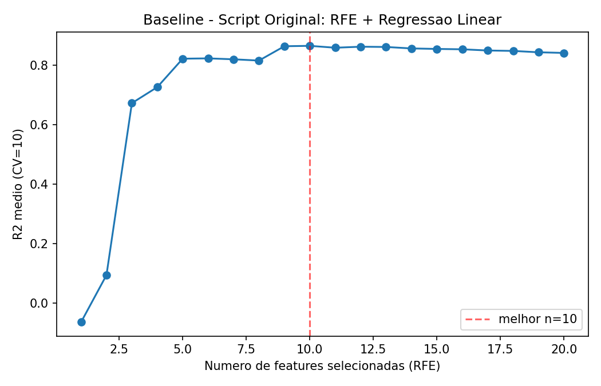
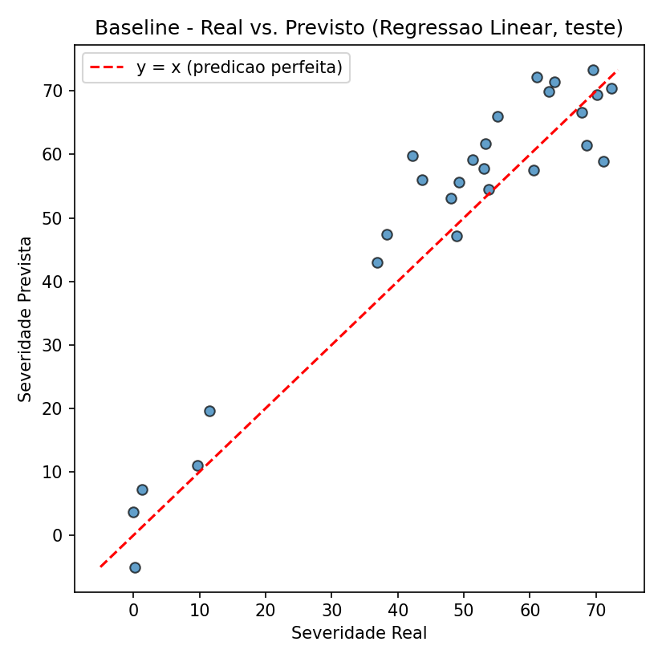
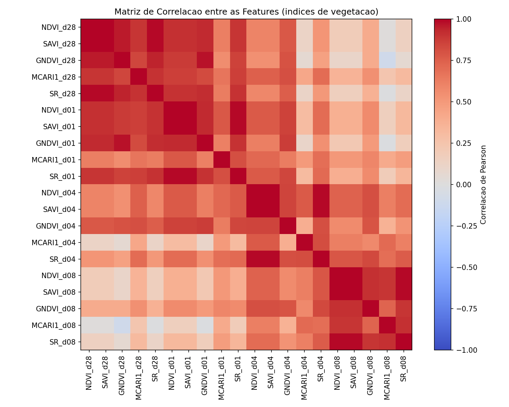
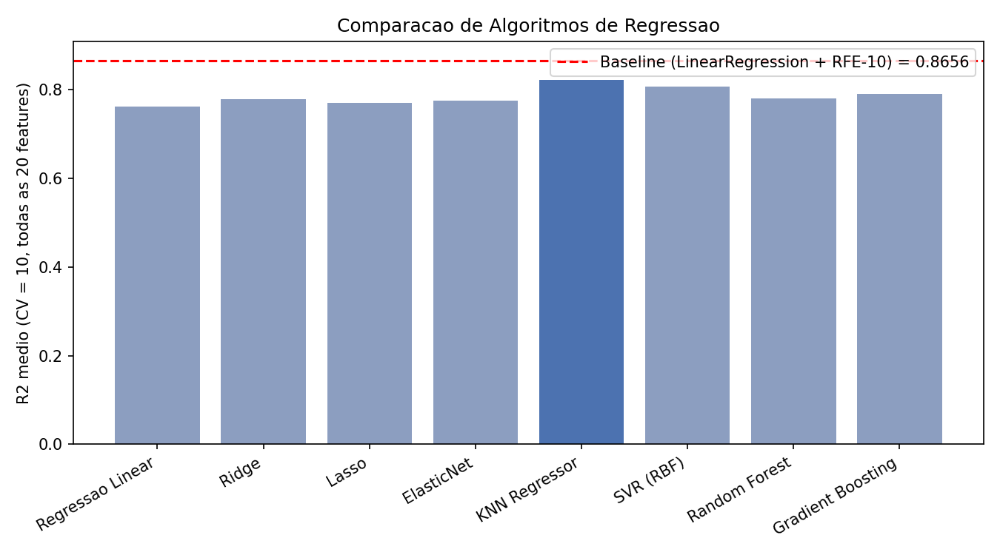
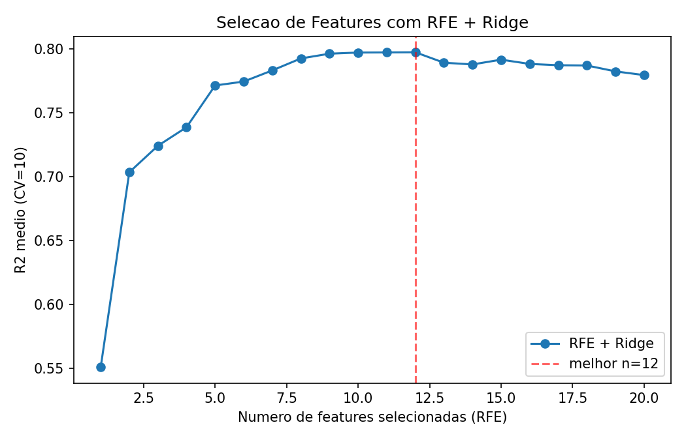
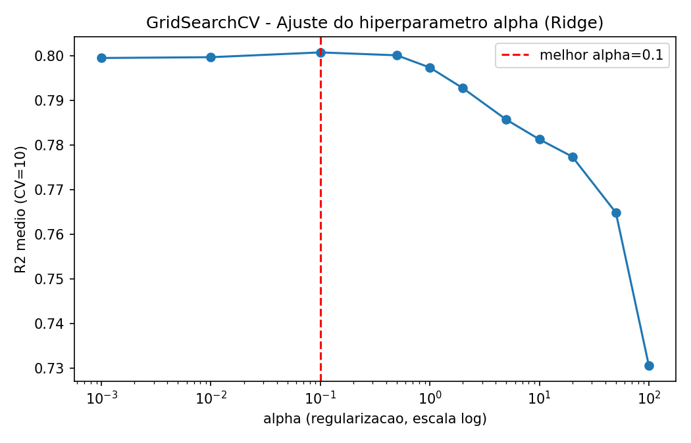
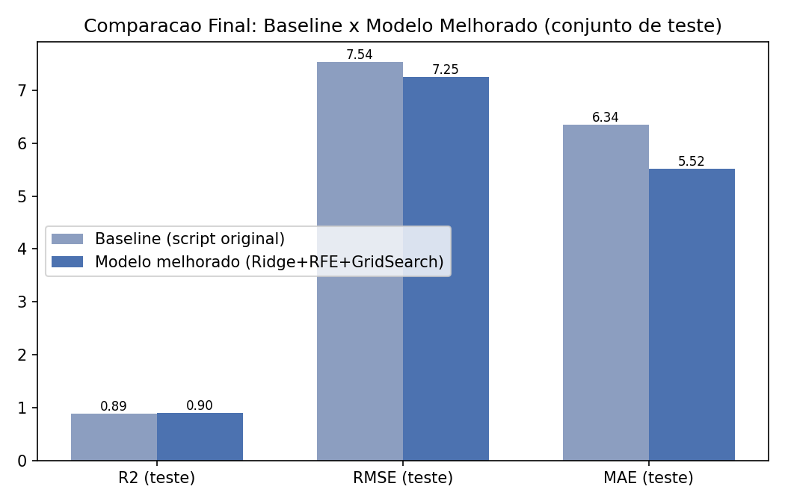
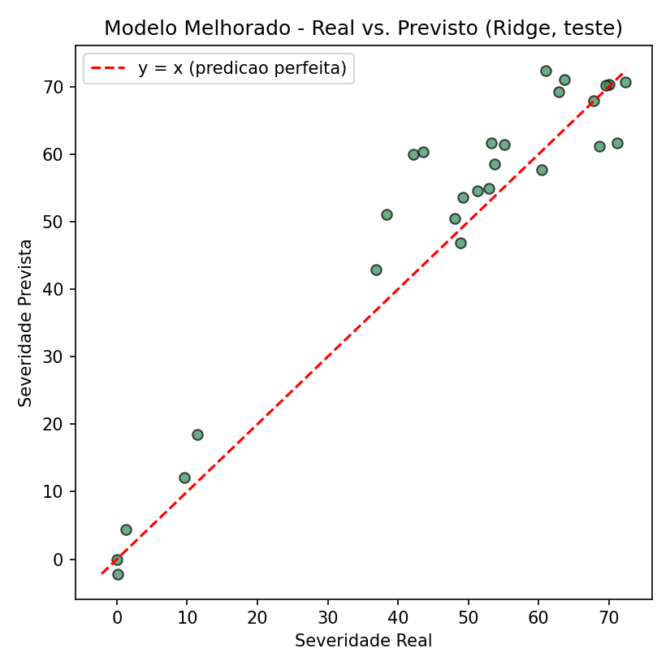

# ELT579 - Aprendizado de Máquina Aplicado
## Relatório - Semana 2: Regressão e Seleção de Features (Severidade de Doença em Tomate)

**Aluno:** 123103
**Disciplina:** ELT579 - Aprendizado de Máquina Aplicado

---

## 1) Introdução

O problema da Semana 2 consiste em prever a **severidade de uma doença em plantas de tomate**
(coluna `Severidade`, variável contínua) a partir de **índices de vegetação** extraídos de imagens
de sensoriamento remoto (drone), calculados em quatro momentos distintos do ciclo da cultura
(dias 1, 4, 8 e 28). Para cada dia estão disponíveis cinco índices — `NDVI`, `SAVI`, `GNDVI`,
`MCARI1` e `SR` — totalizando **20 variáveis preditoras (features)** para **132 amostras** no
arquivo `dataset_problema2.csv`.

O script fornecido (`script_problema2.py`) implementa um pipeline de regressão que:
1. separa os dados em treino (80%) e teste (20%);
2. padroniza as features com `StandardScaler`;
3. aplica **Recursive Feature Elimination (RFE)** com `LinearRegression` para encontrar o número
   ideal de features (testando de 1 a 20), avaliado por validação cruzada (10 folds, métrica R²);
4. treina o modelo final de Regressão Linear Múltipla com as 10 features selecionadas e o avalia
   no conjunto de teste (R², RMSE, MAE).

Este relatório documenta a reprodução desse pipeline original (baseline) e as modificações
implementadas com o objetivo de melhorar a qualidade da predição.

## 2) Objetivo

- Implementar e executar a solução original do problema da Semana 2, reproduzindo os resultados
  do script `script_problema2.py`.
- Investigar a estrutura dos dados (correlação entre as 20 features) para embasar decisões de
  modelagem.
- Testar modificações no pipeline (outros algoritmos de regressão, outro estimador na seleção
  de features, otimização de hiperparâmetros) buscando **melhorar as métricas de predição**
  (aumentar R², reduzir RMSE e MAE) em relação ao script original.
- Comparar quantitativamente o modelo original (baseline) com o modelo melhorado, usando
  exatamente a mesma divisão treino/teste (`random_state = 0`, `test_size = 0.2`) para garantir
  uma comparação justa.

## 3) Metodologia

### 3.1 Reprodução do script original (baseline)

O script original foi executado sem alterações para obter os valores de referência. Ele usa
`train_test_split` (80/20, `random_state=0`), `StandardScaler`, e `RFE` com `LinearRegression`
percorrendo de 1 a 20 features, escolhendo o modelo final com **10 features**.

**Print do resultado obtido (curva de R² por número de features via RFE):**

A curva mostra que o R² cresce rapidamente até ~5-6 features, oscila e atinge o pico em **10
features** (R² médio de validação cruzada = 0.8656), que é exatamente o valor usado no script
original — confirmando que o script fornecido já está configurado no ponto ótimo da curva.

**Print do resultado no conjunto de teste (Real vs. Previsto):**

Os pontos ficam razoavelmente próximos da reta y = x, mas com dispersão visível em severidades
mais altas, indicando espaço para melhoria.

### 3.2 Modificações implementadas

Foram implementadas quatro modificações no pipeline, cada uma com uma motivação específica:

**a) Análise de correlação entre features (multicolinearidade).**
Antes de mexer no modelo, foi gerada a matriz de correlação das 20 features para entender a
estrutura do problema:

Foram encontrados **64 pares de features com correlação absoluta acima de 0.9**. Isso é esperado,
já que os cinco índices (NDVI, SAVI, GNDVI, MCARI1, SR) são derivados das mesmas bandas espectrais
e os quatro dias de coleta captam o mesmo fenômeno em momentos próximos. Essa multicolinearidade
alta prejudica a Regressão Linear pura (coeficientes instáveis) e motivou a troca do estimador
usado na seleção de features por um modelo com regularização (Ridge), mais robusto a esse tipo de
dependência entre variáveis.

**b) Comparação sistemática de 8 algoritmos de regressão.**
Em vez de assumir que a Regressão Linear é o melhor modelo, foi feito um benchmark com validação
cruzada (10 folds, embaralhados) usando todas as 20 features padronizadas: Regressão Linear,
Ridge, Lasso, ElasticNet, KNN Regressor, SVR (kernel RBF), Random Forest e Gradient Boosting.

| Modelo | R² médio (CV=10) |
|---|---|
| KNN Regressor | 0.8228 |
| SVR (RBF) | 0.8073 |
| Gradient Boosting | 0.7901 |
| Ridge | 0.7794 |
| ElasticNet | 0.7761 |
| Random Forest | 0.7806 |
| Lasso | 0.7711 |
| Regressão Linear | 0.7612 |

O KNN teve o melhor desempenho bruto com todas as features, mas **não expõe coeficientes nem
`feature_importances_`**, o que o torna incompatível com o RFE (técnica de seleção de features
usada no script original). Por isso, optou-se por seguir com o **Ridge**, que manteve a
compatibilidade com RFE, é interpretável (mantém coeficientes) e já supera a Regressão Linear
pura ao lidar melhor com a multicolinearidade identificada no item (a). O uso do KNN com outro
método de seleção de features (ex.: `SelectKBest`) fica registrado como sugestão de trabalho
futuro.

**c) Nova seleção de features: RFE com Ridge em vez de Regressão Linear.**
Repetiu-se a busca de 1 a 20 features, agora usando `Ridge` como estimador de base do RFE:

O número ótimo de features passou a ser **12** (em vez de 10 no script original), com um
subconjunto de features diferente do original — incluindo, por exemplo, `MCARI1_d28`, que não
aparecia entre as 10 features escolhidas pelo script original.

**d) Otimização de hiperparâmetro via GridSearchCV.**
Com as 12 features selecionadas, foi feita uma busca em grade do parâmetro de regularização
`alpha` do Ridge, testando 11 valores em escala logarítmica (de 0.001 a 100):

O melhor valor encontrado foi **alpha = 0.1**, indicando que uma regularização leve já é
suficiente para estabilizar o modelo sem prejudicar seu poder preditivo.

### 3.3 Modelo final melhorado

O modelo final combina as três modificações: **Ridge (alpha = 0.1) + RFE com 12 features +
mesmo split treino/teste do script original**, permitindo comparação direta e justa com o
baseline.

## 4) Resultados

### 4.1 Tabela comparativa (conjunto de teste, mesmo split `random_state=0`)

| Métrica | Baseline (script original) | Modelo melhorado (Ridge + RFE + GridSearch) | Variação |
|---|---|---|---|
| R² (teste) | 0.8876 | **0.8961** | +0.0085 (+0,96%) |
| RMSE (teste) | 7.5395 | **7.2492** | -0.2903 (-3,85%) |
| MAE (teste) | 6.3441 | **5.5199** | -0.8242 (-12,99%) |
| Nº de features | 10 | 12 | +2 |
| Modelo | Regressão Linear | Ridge (alpha=0.1) | — |

### 4.2 Gráfico comparativo final

### 4.3 Real vs. Previsto — modelo melhorado

Comparando com o gráfico do baseline (seção 3.1), os pontos do modelo melhorado ficam mais
próximos da reta y = x, especialmente nos valores intermediários de severidade, refletindo a
redução do MAE (erro médio absoluto caiu de 6.34 para 5.52 unidades de severidade).

### 4.4 Discussão dos resultados

- As três modificações (troca do estimador base do RFE para Ridge, ajuste do número de features
  para 12 e otimização do hiperparâmetro `alpha` via GridSearchCV) resultaram em melhoria
  **consistente nas três métricas** avaliadas no conjunto de teste: R² maior, RMSE menor e MAE
  menor.
- O ganho mais expressivo foi no **MAE (-13%)**, indicando que o modelo melhorado erra menos "na
  média" ao prever a severidade da doença, o que é relevante em um cenário prático de apoio à
  decisão agronômica (ex.: definir limiares para intervenção no campo).
- A análise de correlação (seção 3.2-a) explica por que a simples Regressão Linear do script
  original, apesar de já obter um bom resultado, é mais sensível a ruído: com 64 pares de features
  fortemente correlacionadas, pequenas variações nos dados de treino podem gerar coeficientes
  instáveis. A regularização Ridge mitiga esse problema.
- O benchmark de algoritmos (seção 3.2-b) mostrou que modelos não-lineares como KNN e SVR também
  são competitivos neste problema, e ficam como sugestão natural de extensão futura — desde que
  combinados com um método de seleção de features compatível (ex.: `SelectKBest`,
  `SequentialFeatureSelector`), já que o RFE exige um estimador com coeficientes ou importância
  de features.

## 5) Conclusão

O script original já apresentava uma boa solução (R² de teste ≈ 0.89), e as modificações
implementadas — análise de multicolinearidade, benchmark de algoritmos, troca do estimador do RFE
para Ridge e otimização de hiperparâmetro via GridSearchCV — produziram uma melhoria mensurável e
consistente em todas as métricas de erro avaliadas, mantendo a interpretabilidade do modelo linear
original.

## Anexos

- Script original executado (baseline): `relatorio_outputs/baseline.py`
- Script com as modificações implementadas: `script_problema2_melhorado.py`
- Arquivos de saída numérica: `relatorio_outputs/baseline_resultados.txt`,
  `relatorio_outputs/melhorado_resultados.txt`
